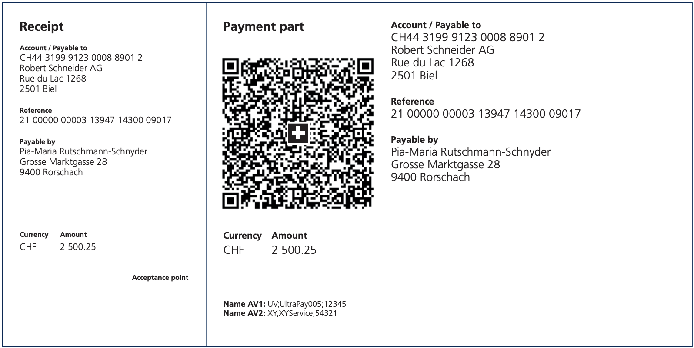

# Different Types

There are 5 different types of ISR:

## ESR boxed

* boxed number fields
* for direct PostFinance clients
* ```->setType(Configuration::ESR_BOXED)```


## ESR bordered

* same as ESR boxed, but with one, think border around the number field
* ```->setType(Configuration::ESR_BORDERED)```


## BESR boxed

* additional receiver field for post account of the client's bank
* ```setBank('UBS AG')->setBankCity('8001 Zürich')```
* ```->setType(Configuration::ESR_BOXED)```


## BESR bordered

* same as BESR boxed, but with one, think border around the number field
* ```->setType(Configuration::BESR_BORDERED)```


## QR

* Payment part with Swiss QR Code and of the receipt
* ```->setType(Configuration::TYPE_QR)```
* ```->setReceiverAccountIBAN('CH4431999123000889012');```
Has to be a QR-IBAN, if you do not have one, ask your bank! `->setReceiverAccount` is not needed with the QR Type.

_Optional:_
```
->setAlternativeSchemes([
    'Name AV1: UV;UltraPay005;12345',
    'Name AV2: XY;XYService;54321',
]);
```
```
->setMessage('Invoice for Order #123123');
```



* [back to index](index.md)
