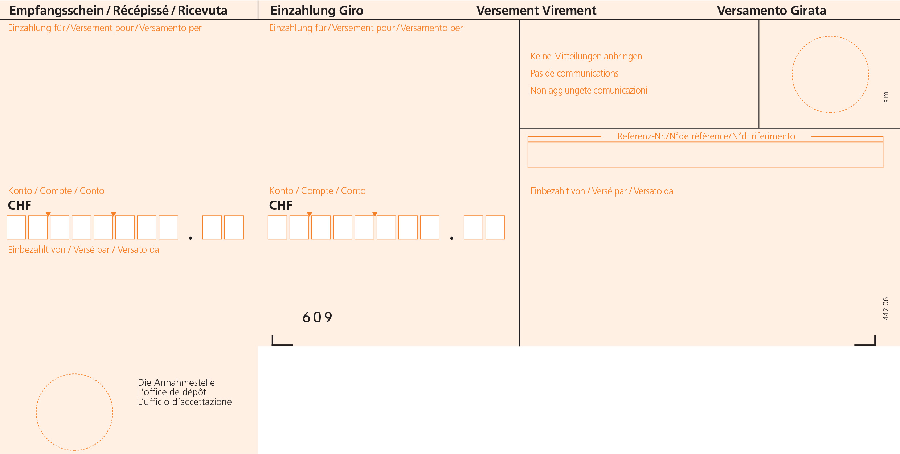
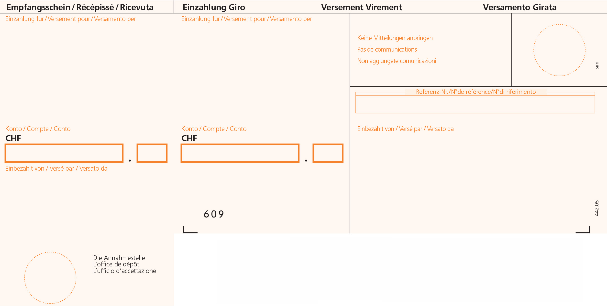
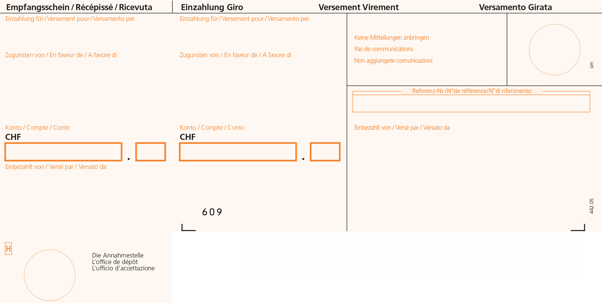

# Different Types

There are 4 different types of ISR:

## ESR boxed

* boxed number fields
* for direct PostFinance clients
* ```->setType(Configuration::ESR_BOXED)```



## ESR bordered

* same as ESR boxed, but with one, think border around the number field
* ```->setType(Configuration::ESR_BORDERED)```



## BESR boxed

* additional receiver field for post account of the client's bank
* ```setBank('UBS AG')->setBankCity('8001 Zürich')```
* ```->setType(Configuration::ESR_BOXED)```


## BESR bordered

* same as BESR boxed, but with one, think border around the number field
* ```->setType(Configuration::BESR_BORDERED)```




* [back to index](index.md)
